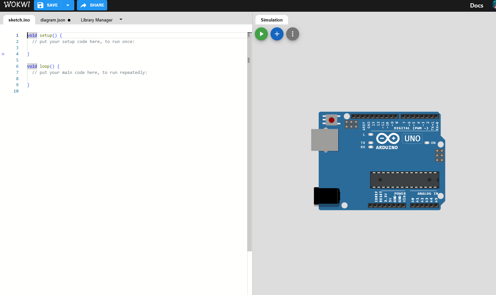
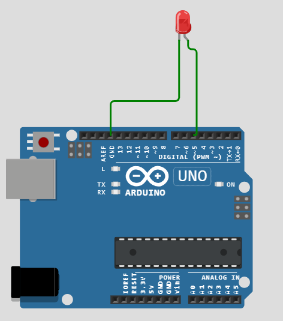
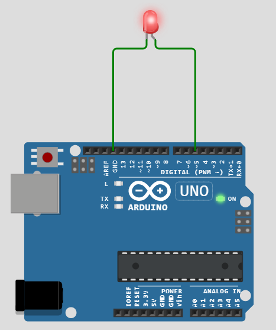
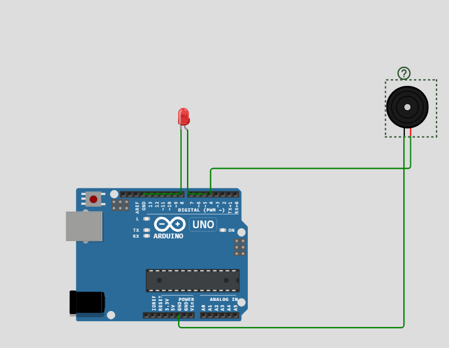
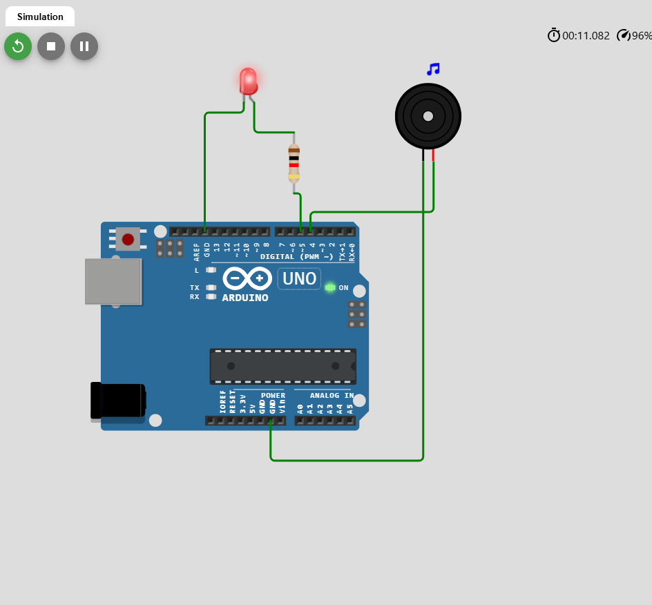

# Aufbau eines Parkwarnsystems mit Arduino auf Wokwi.com

## Einführung

In diesem Schritt-für-Schritt-Tutorial zeigen wir dir, wie du online mit dem [Wokwi Arduino Simulator](https://wokwi.com/) ein Parkwarnsystem mit Arduino aufbaust. Wir beginnen mit einer einfachen LED-Schaltung, fügen dann einen Summer (Buzzer) hinzu und integrieren schließlich einen Ultraschallsensor, um das Parkwarnsystem zu vervollständigen. Mit diesem Ansatz kannst du jede Komponente einzeln testen, bevor du sie kombinierst, und somit sicherstellen, dass du ein gutes Verständnis für jede einzelne Komponente entwickelst.

---

## Voraussetzungen

- **Internetverbindung**: Wir nutzen einen Online-Simulator.
- **Webbrowser**: Chrome, Firefox oder ein anderer moderner Browser.
- **Grundlegende Arduino-Kenntnisse**: Ein grundlegendes Verständnis der Arduino-Programmierung ist hilfreich, aber nicht zwingend erforderlich.

---

## Abschnitt Eins: Ausgänge – LED und Summer

### Teil 1: Ein neues Projekt auf Wokwi.com erstellen

#### Schritt 1: Zugriff auf Wokwi

1. Öffne deinen Webbrowser und gehe zur [Wokwi Arduino Simulator](https://wokwi.com/).
2. Klicke auf **"Start Creating"** oder gehe direkt zu [Neues Arduino Uno Projekt erstellen](https://wokwi.com/projects/new/arduino-uno).

  
*Wokwi Arduino Simulator Startseite*

### Teil 2: Eine LED hinzufügen und testen

#### Schritt 1: Eine LED in den Schaltkreis einfügen

1. **LED hinzufügen**:
   - Klicke in der linken Seitenleiste auf den Tab **"Parts"**.
   - Suche nach **"LED"**.
   - Ziehe die **LED** auf die Arbeitsfläche.

2. **LED mit dem Arduino verbinden**:
   - **Anode (+)** (langer Pin) mit **Digital Pin 5** am Arduino verbinden.
   - **Kathode (-)** (kurzer Pin) mit einem **220Ω Widerstand** verbinden.
     - Füge aus der Teileliste einen **Resistor** hinzu und setze dessen Wert auf **220Ω**.
   - Das andere Ende des Widerstands mit **GND** (Masse) des Arduino verbinden.

  
*LED an Arduino-Pin 5 mit 220Ω Widerstand*

#### Schritt 2: Code zum Blinken der LED schreiben

Klicke auf den **"Code"**-Tab (in der Regel links oder unten am Bildschirm) und gib den folgenden Code ein:

```arduino
#define ledPin 5

void setup() {
  pinMode(ledPin, OUTPUT);
}

void loop() {
  digitalWrite(ledPin, HIGH);  // LED einschalten
  delay(1000);                 // Eine Sekunde warten
  digitalWrite(ledPin, LOW);   // LED ausschalten
  delay(1000);                 // Eine Sekunde warten
}
```

#### Schritt 3: LED testen

1. Klicke auf den **"Start Simulation"**-Button (grünes Play-Symbol oben).
2. Beobachte, wie die LED im Sekundentakt an- und ausgeschaltet wird.
3. Falls es nicht funktioniert:
   - Überprüfe die Verkabelung.
   - Stelle sicher, dass Anode und Kathode richtig angeschlossen sind.
   - Kontrolliere, ob der Widerstandswert auf **220Ω** gesetzt ist.

  
*Simulation der blinkenden LED in Wokwi*

### Teil 3: Einen Summer hinzufügen und testen

#### Schritt 1: Einen Summer zum Schaltkreis hinzufügen

1. **Summer hinzufügen**:
   - Suche nach **"Piezo Buzzer"** in der Teileliste.
   - Ziehe den **Piezo Summer** auf die Arbeitsfläche.

2. **Summer mit Arduino verbinden**:
   - **Positive (+)**-Klemme des Summers an **Digital Pin 4** des Arduino anschließen.
   - **Negative (-)**-Klemme an **GND** des Arduino anschließen.

  
*Summer zur Schaltung hinzufügen, verbunden mit Arduino-Pin 4*

#### Schritt 2: Code um den Summer erweitern

Modifiziere deinen bestehenden Code wie folgt:

```arduino
#define ledPin 5
#define buzzerPin 4

void setup() {
  pinMode(ledPin, OUTPUT);
  pinMode(buzzerPin, OUTPUT);
  tone(8, 262, 250); // Spielt einen 262Hz Ton für 0.250 Sekunden
}

void loop() {
  // LED einschalten
  digitalWrite(ledPin, HIGH);
  // Summer einschalten
  tone(buzzerPin, 300);
  digitalWrite(buzzerPin, HIGH);
  delay(1000);  // Eine Sekunde warten

  // LED ausschalten
  digitalWrite(ledPin, LOW);
  noTone(buzzerPin);
  // Summer ausschalten
  
  delay(1000);  // Eine Sekunde warten
  // tone(8, 262, 250); // Spielt einen 262Hz Ton für 0.250 Sekunden
}
```

#### Schritt 3: LED und Summer testen

1. **Simulation neu starten**:
   - Klicke auf den **"Restart Simulation"**-Button (Symbol mit kreisförmigem Pfeil).

2. **Ausgänge beobachten**:
   - Die LED sollte im Sekundentakt ein- und ausgeschaltet werden.
   - Der Summer sollte im gleichen Takt ein- und ausschalten.

3. **Fehlersuche**:
   - Falls du den Summer nicht hörst:
     - Stelle sicher, dass der Ton deines Computers aktiviert ist.
     - Überprüfe die Verkabelung des Summers.

  
