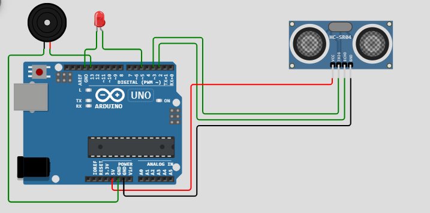
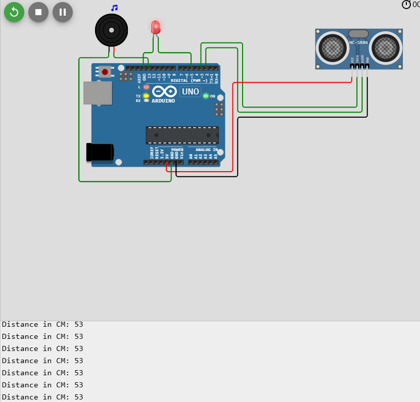

# Abschnitt Drei: Aufbau des Parkwarnsystems – Detaillierte Schritte

## Teil 1: Überprüfung und Vorbereitung der Komponenten

Bevor wir mit der Integration der Komponenten beginnen, stelle sicher, dass du Folgendes hast:

- **Eine LED**, die an Digital Pin 5 angeschlossen und getestet ist.
- **Einen Summer (Buzzer)**, der an Digital Pin 4 angeschlossen und getestet ist.
- **Einen Ultraschallsensor (HC-SR04)**, der am Arduino angeschlossen ist.

Wenn du diese Komponenten noch nicht hinzugefügt hast, findest du in **Abschnitt Eins** und **Abschnitt Zwei** Anleitungen zum Einzeln hinzufügen und Testen der LED, des Summers und des Ultraschallsensors.

---

## Teil 2: Komponenten im Wokwi-Simulator kombinieren

### Schritt 1: Aufbau der vollständigen Schaltung

1. **Zugriff auf den Wokwi Arduino Simulator**:

   - Öffne den [Wokwi Arduino Simulator](https://wokwi.com/).
   - Erstelle ein neues Projekt: [Arduino Uno Projekt](https://wokwi.com/projects/new/arduino-uno).

2. **Komponenten zur Arbeitsfläche hinzufügen**:

   - **Arduino Uno** (standardmäßig bereits vorhanden).
   - **LED**:
     - Ziehe eine **LED** auf die Arbeitsfläche.
     - Verbinde die **Anode (+)** über einen **220Ω Widerstand** mit **Digital Pin 5**.
     - Verbinde die **Kathode (-)** mit **GND**.
   - **Summer**:
     - Ziehe einen **Piezo Summer** auf die Arbeitsfläche.
     - Verbinde den **Positiven (+)** Pin mit **Digital Pin 4**.
     - Verbinde den **Negativen (-)** Pin mit **GND**.
   - **Ultraschallsensor (HC-SR04)**:
     - Ziehe den **HC-SR04 Ultraschallsensor** auf die Arbeitsfläche.
     - Verbinde **VCC** mit **5V**.
     - Verbinde **GND** mit **GND**.
     - Verbinde **Trig** mit **Digital Pin 3**.
     - Verbinde **Echo** mit **Digital Pin 2**.

  
*Kompletter Schaltkreis des Parkwarnsystems in Wokwi*

### Schritt 2: Überprüfung der Verbindungen

- Überprüfe alle Verbindungen auf Richtigkeit.
- Alle **GND**-Verbindungen sollten mit dem **GND**-Pin des Arduinos verbunden sein.
- Der Widerstandswert für die LED sollte **220Ω** betragen.

---

## Teil 3: Schreiben des integrierten Codes

Nun schreiben wir den Arduino-Code, der die Funktionalitäten von LED, Summer und Ultraschallsensor kombiniert.

### Schritt 1: Code-Editor öffnen

- Klicke im Wokwi auf den **"Code"**-Tab, um den Code-Editor zu öffnen.

### Schritt 2: Pin-Zuweisungen definieren

Lege die Pins für die Komponenten am Anfang des Codes fest:

```arduino
// Pins für den Ultraschallsensor definieren
#define PIN_TRIG 3
#define PIN_ECHO 2

// Pins für LED und Summer definieren
#define ledPin 5
#define buzzerPin 4
```

### Schritt 3: Variablen für Timing und Zustände deklarieren

Füge Variablen hinzu, um das Timing und die Zustände von LED und Summer zu verwalten:

```arduino
// Variablen für Timing und Zustandsverwaltung
unsigned long previousMillis = 0;  // Speichert den Zeitpunkt der letzten Aktualisierung
int ledState = LOW;                // Aktueller LED-Zustand
int buzzerState = LOW;             // Aktueller Summer-Zustand
```

### Schritt 4: `setup()`-Funktion einrichten

Initialisiere die serielle Kommunikation und setze die Pin-Modi:

```arduino
void setup() {
  // Serielle Kommunikation zur Fehlersuche initialisieren
  Serial.begin(9600);

  // Pin-Modi für den Ultraschallsensor
  pinMode(PIN_TRIG, OUTPUT);
  pinMode(PIN_ECHO, INPUT);

  // Pin-Modi für LED und Summer
  pinMode(ledPin, OUTPUT);
  pinMode(buzzerPin, OUTPUT);
}
```

### Schritt 5: Struktur der `loop()`-Funktion

Die `loop()`-Funktion soll:

1. Die Entfernung mit dem Ultraschallsensor messen.
2. Die Blink- und Pieps-Intervalle basierend auf der Entfernung berechnen.
3. LED und Summer mithilfe nicht-blockierender Zeitsteuerung aktualisieren.

---

## Teil 4: Entfernungsmessung mit dem Ultraschallsensor

### Schritt 1: Ultraschallsensor auslösen

Füge im `loop()`-Bereich folgenden Code ein, um einen Puls an den Sensor zu senden:

```arduino
void loop() {
  // Ultraschallsensor auslösen
  digitalWrite(PIN_TRIG, LOW);
  delayMicroseconds(2);              // Sorgt für einen sauberen HIGH-Puls
  digitalWrite(PIN_TRIG, HIGH);
  delayMicroseconds(10);             // 10 Mikrosekunden-Puls senden
  digitalWrite(PIN_TRIG, LOW);
```

### Schritt 2: Echo-Zeit auslesen

Messe die Zeit, bis das Echo zurückkommt:

```arduino
  // Echo-Zeit auslesen
  long duration = pulseIn(PIN_ECHO, HIGH);
```

### Schritt 3: Entfernung berechnen

Wandle die Dauer in eine Entfernung in Zentimetern um:

```arduino
  // Entfernung in Zentimetern berechnen
  int distance = duration / 58;
```

### Schritt 4: Entfernung zur Fehlersuche ausgeben

Gib die Entfernung im seriellen Monitor aus:

```arduino
  // Entfernung im seriellen Monitor ausgeben
  Serial.print("Distance: ");
  Serial.print(distance);
  Serial.println(" cm");
```

---

## Teil 5: Berechnung von Blink- und Pieps-Intervallen

### Schritt 1: Verzögerung basierend auf der Entfernung berechnen

Füge Code hinzu, um die Blink-/Pieps-Geschwindigkeit abhängig von der Entfernung festzulegen:

```arduino
  // Blinkintervall anhand der Entfernung berechnen
  int blinkDelay;
  if (distance <= 0 || distance > 400) {
    blinkDelay = 1000;  // Standard: langsames Blinken bei ungültiger/freier Messung
  } else {
    blinkDelay = (distance * 2) + 50;  // Je näher, desto schneller das Blinken/Piepen
  }
```

**Erläuterung**:

- **Ungültige Messungen**: Liegt die Entfernung außerhalb des Sensorbereichs, wird ein langsames Standardblinken verwendet.
- **Dynamische Berechnung**: Der Wert für `blinkDelay` nimmt mit abnehmender Entfernung ab, sodass LED und Summer häufiger aktiviert werden.

---

## Teil 6: Nicht-blockierendes Timing umsetzen

Nutze die `millis()`-Funktion, um das Timing zu steuern, ohne den Programmablauf anzuhalten.

### Schritt 1: Zeit überprüfen

Vergleiche die aktuelle Zeit mit der letzten Aktualisierungszeit:

```arduino
  // Aktuelle Zeit ermitteln
  unsigned long currentMillis = millis();

  // Prüfen, ob es Zeit für ein Update ist
  if (currentMillis - previousMillis >= blinkDelay) {
    previousMillis = currentMillis;  // Aktuelle Zeit speichern
```

### Schritt 2: LED-Zustand umschalten

Aktualisiere die LED entsprechend ihrem aktuellen Zustand:

```arduino
    // LED-Zustand umschalten
    ledState = (ledState == LOW) ? HIGH : LOW;
    digitalWrite(ledPin, ledState);
```

### Schritt 3: Summer-Zustand umschalten

Steuere den Summer analog zur LED:

```arduino
    // Summer-Zustand umschalten
    if (buzzerState == LOW) {
      buzzerState = HIGH;
      tone(buzzerPin, 1000);  // Summer mit 1000 Hz starten
    } else {
      buzzerState = LOW;
      noTone(buzzerPin);      // Summer ausschalten
    }
  }
}
```

---

## Teil 7: Kompletter Code für die `loop()`-Funktion

Deine vollständige `loop()`-Funktion sollte nun wie folgt aussehen:

```arduino
void loop() {
  // Ultraschallsensor auslösen
  digitalWrite(PIN_TRIG, LOW);
  delayMicroseconds(2);              
  digitalWrite(PIN_TRIG, HIGH);
  delayMicroseconds(10);             
  digitalWrite(PIN_TRIG, LOW);

  // Echo-Zeit auslesen
  long duration = pulseIn(PIN_ECHO, HIGH);

  // Entfernung in Zentimetern berechnen
  int distance = duration / 58;

  // Entfernung im seriellen Monitor ausgeben
  Serial.print("Distance: ");
  Serial.print(distance);
  Serial.println(" cm");

  // Blinkintervall berechnen
  int blinkDelay;
  if (distance <= 0 || distance > 400) {
    blinkDelay = 1000;  
  } else {
    blinkDelay = (distance * 2) + 50;  
  }

  // Aktuelle Zeit ermitteln
  unsigned long currentMillis = millis();

  // Ausgänge aktualisieren, wenn Zeit abgelaufen ist
  if (currentMillis - previousMillis >= blinkDelay) {
    previousMillis = currentMillis;  

    // LED-Zustand umschalten
    ledState = (ledState == LOW) ? HIGH : LOW;
    digitalWrite(ledPin, ledState);

    // Summer-Zustand umschalten
    if (buzzerState == LOW) {
      buzzerState = HIGH;
      tone(buzzerPin, 1000);  
    } else {
      buzzerState = LOW;
      noTone(buzzerPin);      
    }
  }
}
```

---

## Teil 8: Test des Parkwarnsystems

### Schritt 1: Simulation starten

- Klicke im Wokwi auf den **"Start Simulation"**-Button.

### Schritt 2: Seriellen Monitor öffnen

- Klicke auf das **"Serial Monitor"**-Symbol, um die Entfernungswerte anzuzeigen.

### Schritt 3: Hindernisentfernung anpassen

- Klicke in der Simulation auf den Ultraschallsensor.
- Ein Schieberegler oder Eingabefeld erscheint, um die Entfernung des Hindernisses einzustellen.
- Verändere den Abstand und beobachte, wie sich die Messwerte ändern.

### Schritt 4: Verhalten des Systems beobachten

- **LED**: Blinkt schneller, je näher das Hindernis kommt.
- **Summer**: Piept schneller, je näher das Hindernis kommt.
- **Serieller Monitor**: Zeigt die aktuellen Entfernungswerte an.

  
*Simulation des Parkwarnsystems, das auf die Hindernisentfernung reagiert*

### Schritt 5: Fehlersuche

- **LED oder Summer reagieren nicht**:
  - Überprüfe alle Verbindungen und Pin-Zuordnungen.
  - Vergewissere dich, dass der Widerstand korrekt angeschlossen ist.
- **Keine Entfernungswerte**:
  - Prüfe die Anschlüsse des Ultraschallsensors an **Trig** und **Echo**.
  - Stelle sicher, dass der Sensor mit **5V** und **GND** verbunden ist.

---

## Teil 9: Funktionsweise des Systems verstehen

### Wie das Parkwarnsystem funktioniert

1. **Entfernungsmessung**:

   - Der Ultraschallsensor misst kontinuierlich den Abstand zum nächsten Objekt.
   - Der Arduino berechnet den Wert basierend auf den Sensordaten.

2. **Dynamische Reaktion**:

   - Das System berechnet das `blinkDelay` basierend auf der gemessenen Entfernung.
   - Je näher das Objekt, desto kürzer die Verzögerung, desto häufiger blinken LED und piepen Summer.

3. **Nicht-blockierendes Timing**:

   - Durch die Verwendung von `millis()` arbeitet das System ohne Unterbrechung.
   - Die Messung der Entfernung läuft kontinuierlich und flüssig weiter.

4. **Aktivierung der Ausgänge**:

   - LED und Summer werden je nach Abstand umgeschaltet.
   - Sie bieten visuelle und akustische Warnungen, wenn sich ein Objekt nähert.

---

## Teil 10: Feinabstimmung und Erweiterungen

### Empfindlichkeit anpassen

Du kannst die Formel für `blinkDelay` ändern, um die Reaktion des Systems anzupassen:

- **Höhere Empfindlichkeit**:

  ```arduino
  blinkDelay = (distance * 1) + 20;
  ```

- **Geringere Empfindlichkeit**:

  ```arduino
  blinkDelay = (distance * 3) + 100;
  ```

### Variable Summerfrequenz

Passe die Frequenz des Summers abhängig von der Entfernung an:

```arduino
// Entfernung auf einen Frequenzbereich abbilden (z.B. 2000 Hz bis 500 Hz)
int frequency = map(distance, 0, 400, 2000, 500);
tone(buzzerPin, frequency);
```

- Näher kommende Objekte führen zu höheren Frequenzen und zusätzlichen akustischen Hinweisen.

### Weitere LEDs hinzufügen

- Schließe zusätzliche LEDs an verschiedene Pins an.
- Lasse mehr LEDs aufleuchten, je näher das Objekt kommt, um eine visuelle Abstandsanzeige zu erstellen.

---

## Teil 11: Dokumentation deines Projekts

Bei der Erstellung einer Projektbeschreibung oder Anleitung solltest du Folgendes beachten:

- **Bilder einfügen**:

  - Mache Screenshots deiner Schaltung in Wokwi.
  - Verwende Bilder, um jeden Schritt besser zu veranschaulichen.

- **Jeden Schritt klar erklären**:

  - Liefere detaillierte Erklärungen für Code und Schaltungsaufbau.
  - Nutze Aufzählungen und Nummerierungen für bessere Übersicht.

- **Diagramme und Ablaufpläne hinzufügen**:

  - Grafische Darstellungen helfen, die Logik und den Ablauf des Systems verständlicher zu machen.

---

## Teil 12: Fazit

Durch das Befolgen dieser detaillierten Schritte hast du ein Parkwarnsystem erstellt, das:

- Die Entfernung zu einem Objekt mithilfe eines Ultraschallsensors misst.
- Die Blink- und Piepton-Frequenzen von LED und Summer basierend auf dieser Entfernung anpasst.
- Visuelles und akustisches Feedback gibt, um den Nutzer vor Annäherung an ein Hindernis zu warnen.

---

## Zusätzliche Ressourcen

- **Wokwi Tutorials**: [Getting Started with Wokwi](https://docs.wokwi.com/)
- **Arduino Referenz**: [Arduino Sprachreferenz](https://www.arduino.cc/reference/de/)
- **Ultraschallsensor Anleitung**: [HC-SR04 Ultraschallsensor – Vollständiger Leitfaden](https://randomnerdtutorials.com/complete-guide-for-ultrasonic-sensor-hc-sr04/) (englisch)

---

**Hinweis**: Ersetze die Platzhalter für Bildlinks (`https://i.imgur.com/your_image_link.png`) durch tatsächliche Screenshots aus deiner Simulation, um das visuelle Erscheinungsbild deiner Dokumentation zu verbessern.
