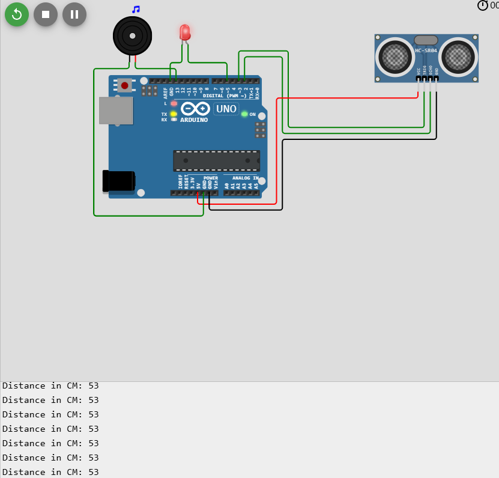

# Section Three: Building the Parking Alarm System - Detailed Steps

## Part 1: Reviewing and Preparing the Components

Before we begin integrating the components, ensure that you have:

- **An LED** connected to Digital Pin 5 and tested.
- **A Buzzer** connected to Digital Pin 4 and tested.
- **An Ultrasonic Sensor (HC-SR04)** connected to the Arduino.

If you haven't added these components yet, please refer to **Section One** and **Section Two** for instructions on how to add and test the LED, buzzer, and ultrasonic sensor individually.

---

## Part 2: Combining the Components in Wokwi Simulator

### Step 1: Setting Up the Complete Circuit

1. **Access Wokwi Arduino Simulator**:

   - Open [Wokwi Arduino Simulator](https://wokwi.com/).
   - Create a new project: [Arduino Uno Project](https://wokwi.com/projects/new/arduino-uno).

2. **Add Components to the Workspace**:

   - **Arduino Uno** (already present by default).
   - **LED**:
     - Drag an **LED** onto the workspace.
     - Connect the **Anode (+)** through a **220Ω resistor** to **Digital Pin 5**.
     - Connect the **Cathode (-)** to **GND**.
   - **Buzzer**:
     - Drag a **Piezo Buzzer** onto the workspace.
     - Connect the **Positive (+)** pin to **Digital Pin 4**.
     - Connect the **Negative (-)** pin to **GND**.
   - **Ultrasonic Sensor (HC-SR04)**:
     - Drag an **HC-SR04 Ultrasonic Sensor** onto the workspace.
     - Connect **VCC** to **5V**.
     - Connect **GND** to **GND**.
     - Connect **Trig** to **Digital Pin 3**.
     - Connect **Echo** to **Digital Pin 2**.


*Complete parking alarm system circuit in Wokwi*

### Step 2: Verifying Connections

- Double-check all connections to ensure accuracy.
- All **GND** connections should be connected to the Arduino's **GND** pin.
- The resistor value for the LED should be set to **220Ω**.

---

## Part 3: Writing the Integrated Code

We'll now write the Arduino code that combines the functionality of the LED, buzzer, and ultrasonic sensor.

### Step 1: Open the Code Editor

- Click on the **"Code"** tab in Wokwi to open the code editor.

### Step 2: Define the Pin Assignments

At the top of your code, define the pins for the components:

```arduino
// Define pins for the ultrasonic sensor
#define PIN_TRIG 3
#define PIN_ECHO 2

// Define pins for the LED and Buzzer
#define ledPin 5
#define buzzerPin 4
```

### Step 3: Declare Variables for Timing and States

Add variables to manage timing and the states of the LED and buzzer:

```arduino
// Variables for timing and state management
unsigned long previousMillis = 0;  // Stores the last time outputs were updated
int ledState = LOW;                // Current state of the LED
int buzzerState = LOW;             // Current state of the Buzzer
```

### Step 4: Set Up the `setup()` Function

Initialize serial communication and set the pin modes:

```arduino
void setup() {
  // Initialize serial communication for debugging
  Serial.begin(9600);

  // Set pin modes for the ultrasonic sensor
  pinMode(PIN_TRIG, OUTPUT);
  pinMode(PIN_ECHO, INPUT);

  // Set pin modes for the LED and Buzzer
  pinMode(ledPin, OUTPUT);
  pinMode(buzzerPin, OUTPUT);
}
```

### Step 5: Create the `loop()` Function Structure

We'll structure the `loop()` function to:

1. Measure the distance using the ultrasonic sensor.
2. Calculate the blink and beep delay based on the distance.
3. Update the LED and buzzer states using non-blocking timing.

---

## Part 4: Measuring Distance with the Ultrasonic Sensor

### Step 1: Trigger the Ultrasonic Sensor

Add the following code inside the `loop()` function to send a pulse to the ultrasonic sensor:

```arduino
void loop() {
  // Trigger the ultrasonic sensor
  digitalWrite(PIN_TRIG, LOW);
  delayMicroseconds(2);              // Ensure a clean HIGH pulse
  digitalWrite(PIN_TRIG, HIGH);
  delayMicroseconds(10);             // Send a 10 microsecond pulse
  digitalWrite(PIN_TRIG, LOW);
```

### Step 2: Read the Echo Time

Measure the time it takes for the echo to return:

```arduino
  // Read the echo time
  long duration = pulseIn(PIN_ECHO, HIGH);
```

### Step 3: Calculate the Distance

Convert the duration to a distance measurement in centimeters:

```arduino
  // Calculate the distance in centimeters
  int distance = duration / 58;
```

### Step 4: Output the Distance for Debugging

Print the distance to the Serial Monitor:

```arduino
  // Print the distance to the Serial Monitor
  Serial.print("Distance: ");
  Serial.print(distance);
  Serial.println(" cm");
```

---

## Part 5: Calculating the Blink and Beep Delay

### Step 1: Compute the Delay Based on Distance

Add code to calculate how fast the LED should blink and the buzzer should beep:

```arduino
  // Calculate the blink interval based on distance
  int blinkDelay;
  if (distance <= 0 || distance > 400) {
    blinkDelay = 1000;  // Default to slow blinking for invalid or far readings
  } else {
    blinkDelay = (distance * 2) + 50;  // Closer distance results in faster blinking/beeping
  }
```

**Explanation**:

- **Invalid Readings**: If the distance is not within the sensor's range, set a default slow blink rate.
- **Dynamic Calculation**: The `blinkDelay` decreases as the distance decreases, causing the LED and buzzer to activate more frequently.

---

## Part 6: Implementing Non-blocking Timing

Use the `millis()` function to manage timing without stopping the program execution.

### Step 1: Check the Timing

Compare the current time with the last update time:

```arduino
  // Get the current time
  unsigned long currentMillis = millis();

  // Check if it's time to update the LED and Buzzer
  if (currentMillis - previousMillis >= blinkDelay) {
    previousMillis = currentMillis;  // Save the current time
```

### Step 2: Toggle the LED State

Update the LED based on its current state:

```arduino
    // Toggle the LED state
    ledState = (ledState == LOW) ? HIGH : LOW;
    digitalWrite(ledPin, ledState);
```

### Step 3: Toggle the Buzzer State

Control the buzzer similarly:

```arduino
    // Toggle the Buzzer state
    if (buzzerState == LOW) {
      buzzerState = HIGH;
      tone(buzzerPin, 1000);  // Start the buzzer at 1000 Hz
    } else {
      buzzerState = LOW;
      noTone(buzzerPin);      // Stop the buzzer
    }
  }
}
```

---

## Part 7: Final Code Assembly

Your complete `loop()` function should now look like this:

```arduino
void loop() {
  // Trigger the ultrasonic sensor
  digitalWrite(PIN_TRIG, LOW);
  delayMicroseconds(2);              // Ensure a clean HIGH pulse
  digitalWrite(PIN_TRIG, HIGH);
  delayMicroseconds(10);             // Send a 10 microsecond pulse
  digitalWrite(PIN_TRIG, LOW);

  // Read the echo time
  long duration = pulseIn(PIN_ECHO, HIGH);

  // Calculate the distance in centimeters
  int distance = duration / 58;

  // Print the distance to the Serial Monitor
  Serial.print("Distance: ");
  Serial.print(distance);
  Serial.println(" cm");

  // Calculate the blink interval based on distance
  int blinkDelay;
  if (distance <= 0 || distance > 400) {
    blinkDelay = 1000;  // Default to slow blinking
  } else {
    blinkDelay = (distance * 2) + 50;  // Adjust delay based on distance
  }

  // Get the current time
  unsigned long currentMillis = millis();

  // Check if it's time to update the outputs
  if (currentMillis - previousMillis >= blinkDelay) {
    previousMillis = currentMillis;  // Save the current time

    // Toggle the LED state
    ledState = (ledState == LOW) ? HIGH : LOW;
    digitalWrite(ledPin, ledState);

    // Toggle the Buzzer state
    if (buzzerState == LOW) {
      buzzerState = HIGH;
      tone(buzzerPin, 1000);  // Start the buzzer
    } else {
      buzzerState = LOW;
      noTone(buzzerPin);      // Stop the buzzer
    }
  }
}
```

---

## Part 8: Testing the Parking Alarm System

### Step 1: Start the Simulation

- Click on the **"Start Simulation"** button in Wokwi.

### Step 2: Open the Serial Monitor

- Click on the **"Serial Monitor"** icon to view the distance readings.

### Step 3: Adjust the Obstacle Distance

- Click on the ultrasonic sensor in the simulation.
- A slider or input box will appear to adjust the obstacle's distance.
- Move the slider to simulate an object moving closer or farther away.

### Step 4: Observe the System Behavior

- **LED**: Should blink faster as the obstacle gets closer.
- **Buzzer**: Should beep more rapidly as the obstacle approaches.
- **Serial Monitor**: Displays the current distance measurements.


*Simulation of the parking alarm system responding to obstacle distance*

### Step 5: Troubleshooting

- **LED or Buzzer Not Responding**:
  - Ensure all components are connected to the correct pins.
  - Verify the resistor value and connections for the LED.
- **No Distance Readings**:
  - Check the connections for the ultrasonic sensor's **Trig** and **Echo** pins.
  - Ensure the sensor is connected to **5V** and **GND**.

---

## Part 9: Understanding the System Logic

### How the Parking Alarm System Works

1. **Distance Measurement**:

   - The ultrasonic sensor continuously measures the distance to the nearest object.
   - The Arduino calculates the distance based on the sensor's readings.

2. **Dynamic Response**:

   - The system calculates the `blinkDelay` based on the measured distance.
   - A shorter distance results in a shorter delay, causing the LED and buzzer to activate more frequently.

3. **Non-blocking Timing**:

   - Using `millis()`, the system updates the outputs without halting program execution.
   - This allows the distance measurement to continue running smoothly.

4. **Outputs Activation**:

   - The LED and buzzer are toggled based on the timing calculated from the distance.
   - They provide visual and auditory feedback, alerting the user as an object approaches.

---

## Part 10: Fine-tuning and Enhancements

### Adjusting Sensitivity

You can modify the formula for `blinkDelay` to change how the system responds:

- **More Sensitive**:

  ```arduino
  blinkDelay = (distance * 1) + 20;
  ```

- **Less Sensitive**:

  ```arduino
  blinkDelay = (distance * 3) + 100;
  ```

### Adding Variable Buzzer Frequency

Change the buzzer frequency based on the distance:

```arduino
// Map the distance to a frequency range (e.g., 2000 Hz to 500 Hz)
int frequency = map(distance, 0, 400, 2000, 500);
tone(buzzerPin, frequency);
```

- Closer objects result in higher frequencies, providing additional auditory cues.

### Implementing Multiple LEDs

- Add more LEDs connected to different pins.
- Light up more LEDs as the object gets closer, creating a visual distance indicator.

---

## Part 11: Documenting Your Project

When creating your readme or tutorial, consider the following:

- **Include Images**:

  - Capture screenshots of your circuit in Wokwi.
  - Use images to illustrate each step for better understanding.

- **Explain Each Step Clearly**:

  - Provide detailed explanations for code and circuit connections.
  - Use bullet points and numbering for clarity.

- **Add Diagrams and Flowcharts**:

  - Visual aids can help explain the logic and flow of the system.

---

## Part 12: Conclusion

By following these detailed steps, you've successfully built a parking alarm system that:

- Measures the distance to an object using an ultrasonic sensor.
- Adjusts the blinking and beeping rates of an LED and buzzer based on the distance.
- Provides visual and auditory feedback to alert the user as an object approaches.

---

## Additional Resources

- **Wokwi Tutorials**: [Getting Started with Wokwi](https://docs.wokwi.com/)
- **Arduino Reference**: [Arduino Language Reference](https://www.arduino.cc/reference/en/)
- **Ultrasonic Sensor Guide**: [How to Use the HC-SR04 Ultrasonic Sensor](https://randomnerdtutorials.com/complete-guide-for-ultrasonic-sensor-hc-sr04/)

---

**Note**: Replace the placeholder image links (`https://i.imgur.com/your_image_link.png`) with actual screenshots from your simulation to enhance the visual appeal of your readme or tutorial.

