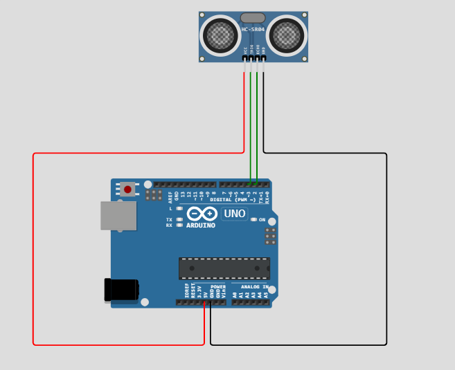

## Abschnitt Zwei: Eingabe – Hinzufügen des Ultraschallsensors

### Teil 1: Hinzufügen des Ultraschallsensors zur Schaltung

#### Schritt 1: Ultraschallsensor hinzufügen

1. **HC-SR04 Ultraschallsensor hinzufügen**:
   - Suche in der Teileliste nach **"HC-SR04"**.
   - Ziehe den **HC-SR04 Ultraschallsensor** auf die Arbeitsfläche.

2. **Sensor mit dem Arduino verbinden**:
   - **VCC**-Pin mit **5V** am Arduino verbinden.
   - **GND**-Pin mit **GND** am Arduino verbinden.
   - **Trig**-Pin mit **Digital Pin 3** am Arduino verbinden.
   - **Echo**-Pin mit **Digital Pin 2** am Arduino verbinden.

  
*Ultraschallsensor mit dem Arduino verbunden*

#### Schritt 2: Code zum Auslesen der Entfernung schreiben

Ersetze deinen bisherigen Code durch den folgenden:

```arduino
#define PIN_TRIG 3
#define PIN_ECHO 2

void setup() {
  Serial.begin(9600);
  pinMode(PIN_TRIG, OUTPUT);
  pinMode(PIN_ECHO, INPUT);
}

void loop() {
  // Ultraschallsensor auslösen
  digitalWrite(PIN_TRIG, LOW);
  delayMicroseconds(2);
  digitalWrite(PIN_TRIG, HIGH);
  delayMicroseconds(10);
  digitalWrite(PIN_TRIG, LOW);

  // Echo-Zeit auslesen
  long duration = pulseIn(PIN_ECHO, HIGH);

  // Entfernung in Zentimetern berechnen
  int distance = duration / 58;

  // Entfernung ausgeben
  Serial.print("Entfernung: ");
  Serial.print(distance);
  Serial.println(" cm");

  delay(500); // Eine halbe Sekunde warten, bevor die nächste Messung durchgeführt wird
}
```

#### Schritt 3: Ultraschallsensor testen

1. **Simulation starten**:
   - Klicke auf den **"Start Simulation"**-Button.

2. **Seriellen Monitor öffnen**:
   - Klicke auf das **"Serial Monitor"**-Symbol (meistens oben rechts).
   - Stelle sicher, dass die Baudrate auf **9600** eingestellt ist.

3. **Entfernungswerte beobachten**:
   - Du wirst die Entfernungswerte in Zentimetern sehen.
   - **Hindernis vor dem Sensor anpassen**:
     - Klicke auf den Ultraschallsensor in der Simulation.
     - Ein Schieberegler oder Eingabefeld erscheint, um den Abstand eines Hindernisses einzustellen.
     - Verändere die Entfernung und beobachte, wie sich die Messwerte im Serial Monitor aktualisieren.

  
*Testen des Ultraschallsensors und Beobachten der Entfernungswerte*
