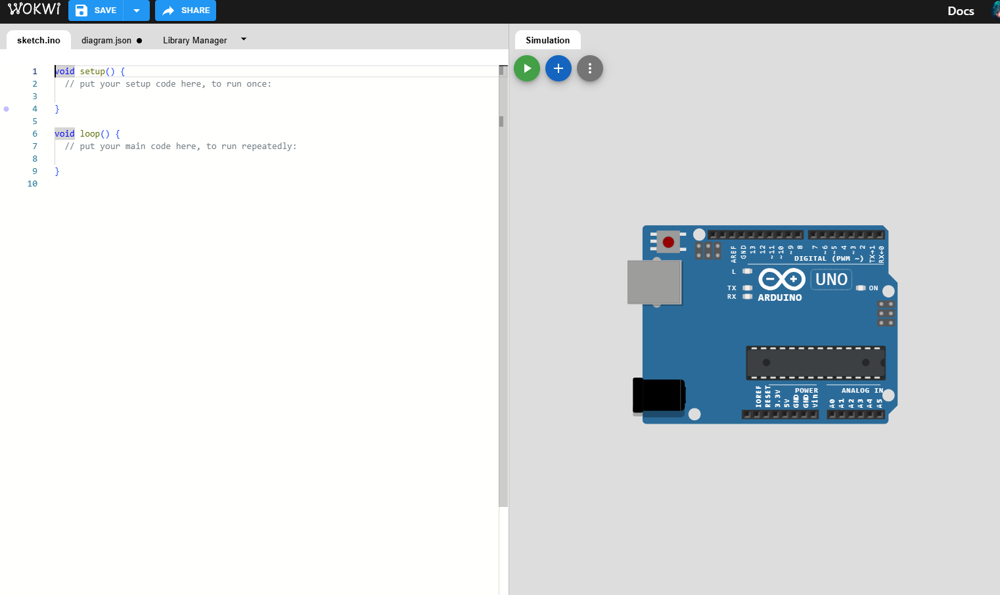
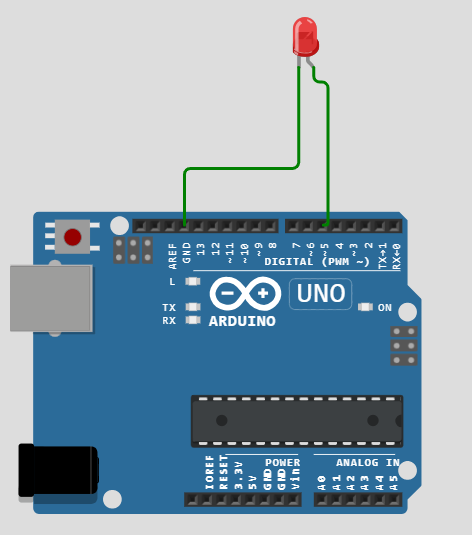
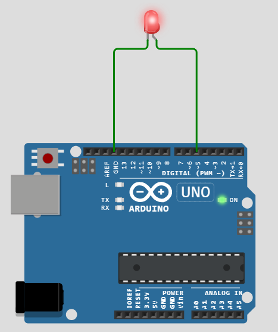
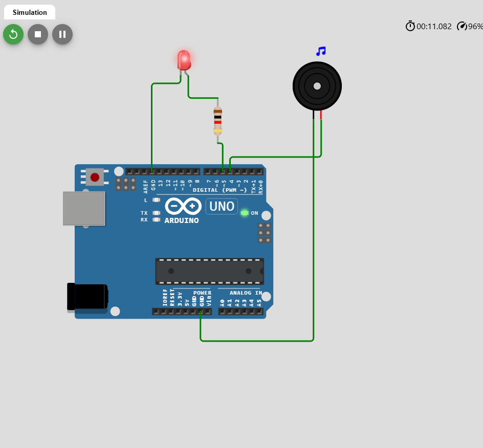

# Building a Parking Alarm System with Arduino on Wokwi.com

## Introduction

In this step-by-step tutorial, we'll guide you through building a parking alarm system using Arduino, entirely online using the [Wokwi Arduino Simulator](https://wokwi.com/). We'll start by creating a simple LED circuit, then add a buzzer, and finally integrate an ultrasonic sensor to complete the parking alarm system. This approach allows you to test each component individually before combining them, ensuring a solid understanding of how each part works.

---

## Prerequisites

- **Internet Access**: We'll be using an online simulator.
- **Web Browser**: Chrome, Firefox, or any modern browser.
- **Basic Arduino Knowledge**: Understanding of basic Arduino programming is helpful but not necessary.

---

## Section One: Outputs - LED and Buzzer

### Part 1: Creating a New Project on Wokwi.com

#### Step 1: Accessing Wokwi

1. Open your web browser and navigate to [Wokwi Arduino Simulator](https://wokwi.com/).
2. Click on **"Start Creating"** or go directly to [Create New Arduino Uno Project](https://wokwi.com/projects/new/arduino-uno).

  
*Wokwi Arduino Simulator Homepage*

### Part 2: Adding an LED and Testing It

#### Step 1: Add an LED to the Circuit

1. **Add an LED**:
   - In the left sidebar, click on the **"Parts"** tab.
   - Search for **"LED"**.
   - Drag and drop the **LED** onto the work area.

2. **Connect the LED to the Arduino**:
   - **Anode (+)** (long leg) connects to **Digital Pin 5** on the Arduino.
   - **Cathode (-)** (short leg) connects to a **220Ω resistor**.
     - Add a **Resistor** from the parts list and set its value to **220Ω**.
   - Connect the other end of the resistor to **GND** (ground) on the Arduino.

  
*LED connected to Arduino Pin 5 with a 220Ω resistor*

#### Step 2: Write Code to Blink the LED

Click on the **"Code"** tab (usually on the left side or bottom of the screen) and enter the following code:

```arduino
#define ledPin 5

void setup() {
  pinMode(ledPin, OUTPUT);
}

void loop() {
  digitalWrite(ledPin, HIGH);  // Turn the LED on
  delay(1000);                 // Wait for one second
  digitalWrite(ledPin, LOW);   // Turn the LED off
  delay(1000);                 // Wait for one second
}
```

#### Step 3: Test the LED

1. Click on the **"Start Simulation"** button (green play icon at the top).
2. Observe the LED blinking on and off every second.
3. If it doesn't work:
   - Double-check your wiring.
   - Ensure the LED's anode and cathode are correctly connected.
   - Verify the resistor value is set to **220Ω**.

  
*Simulating the blinking LED on Wokwi*

### Part 3: Adding a Buzzer and Testing It

#### Step 1: Add a Buzzer to the Circuit

1. **Add a Buzzer**:
   - Search for **"Piezo Buzzer"** in the parts list.
   - Drag and drop the **Piezo Buzzer** onto the work area.

2. **Connect the Buzzer to the Arduino**:
   - **Positive (+)** pin of the buzzer connects to **Digital Pin 4** on the Arduino.
   - **Negative (-)** pin connects to **GND** on the Arduino.

  
*Buzzer added to the circuit, connected to Arduino Pin 4*

#### Step 2: Update the Code to Include the Buzzer

Modify your existing code as follows:

```arduino
#define ledPin 5
#define buzzerPin 4


void setup() {
  pinMode(ledPin, OUTPUT);
  pinMode(buzzerPin, OUTPUT);
  tone(8, 262, 250); // Plays 262Hz tone for 0.250 seconds

}
void loop() {
  // Turn the LED on
  digitalWrite(ledPin, HIGH);
  // Turn the buzzer on
  tone(buzzerPin, 300);
  digitalWrite(buzzerPin, HIGH);
  delay(1000);  // Wait for one second

  // Turn the LED off
  digitalWrite(ledPin, LOW);
  noTone(buzzerPin); 
  // Turn the buzzer off
  
  delay(1000);  // Wait for one second
  // tone(8, 262, 250); // Plays 262Hz tone for 0.250 seconds

}
```

#### Step 3: Test the LED and Buzzer

1. **Restart the Simulation**:
   - Click on the **"Restart Simulation"** button (circular arrow icon).

2. **Observe the Outputs**:
   - The LED should blink on and off every second.
   - The buzzer should beep in sync with the LED.

3. **Troubleshooting**:
   - If you don't hear the buzzer:
     - Ensure your computer's sound is on.
     - Check the buzzer connections.

  
*Simulating the LED and buzzer working together*

---

