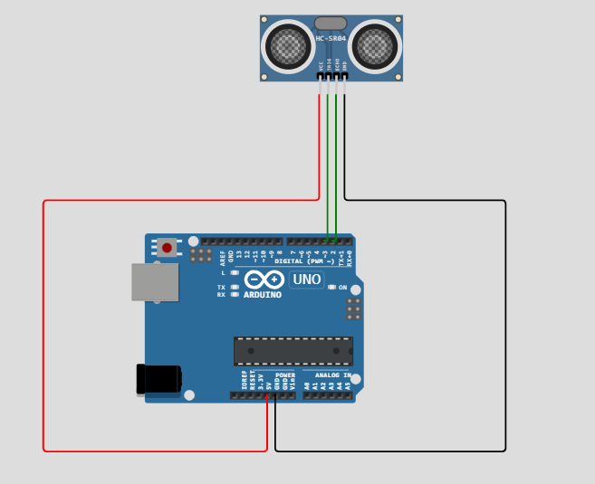
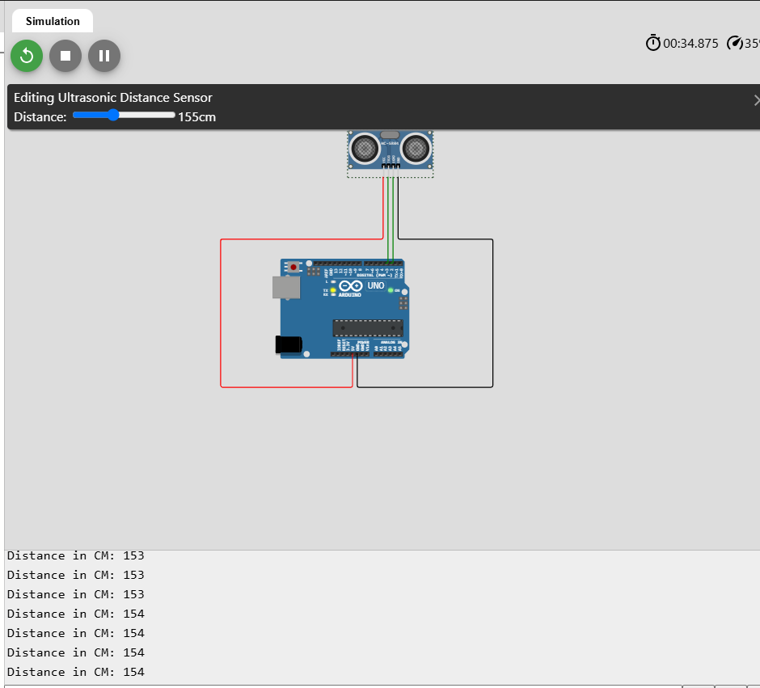

## Section Two: Input - Adding the Ultrasonic Sensor

### Part 1: Adding the Ultrasonic Sensor to the Circuit

#### Step 1: Add the Ultrasonic Sensor

1. **Add HC-SR04 Ultrasonic Sensor**:
   - Search for **"HC-SR04"** in the parts list.
   - Drag and drop the **HC-SR04 Ultrasonic Sensor** onto the work area.

2. **Connect the Sensor to the Arduino**:
   - **VCC** pin connects to **5V** on the Arduino.
   - **GND** pin connects to **GND** on the Arduino.
   - **Trig** pin connects to **Digital Pin 3** on the Arduino.
   - **Echo** pin connects to **Digital Pin 2** on the Arduino.

  
*Ultrasonic sensor connected to the Arduino*

#### Step 2: Write Code to Read Distance from the Ultrasonic Sensor

Replace your previous code with the following:

```arduino
#define PIN_TRIG 3
#define PIN_ECHO 2

void setup() {
  Serial.begin(9600);
  pinMode(PIN_TRIG, OUTPUT);
  pinMode(PIN_ECHO, INPUT);
}

void loop() {
  // Trigger the sensor
  digitalWrite(PIN_TRIG, LOW);
  delayMicroseconds(2);
  digitalWrite(PIN_TRIG, HIGH);
  delayMicroseconds(10);
  digitalWrite(PIN_TRIG, LOW);

  // Read the echo time
  long duration = pulseIn(PIN_ECHO, HIGH);

  // Calculate distance in centimeters
  int distance = duration / 58;

  // Print the distance
  Serial.print("Distance: ");
  Serial.print(distance);
  Serial.println(" cm");

  delay(500); // Wait for half a second before next measurement
}
```

#### Step 3: Test the Ultrasonic Sensor

1. **Start the Simulation**:
   - Click on the **"Start Simulation"** button.

2. **Open the Serial Monitor**:
   - Click on the **"Serial Monitor"** icon (usually on the top right).
   - Ensure the baud rate is set to **9600**.

3. **Observe Distance Readings**:
   - You'll see the distance measurements in centimeters.
   - **Adjust the Sensor's Obstacle**:
     - Click on the ultrasonic sensor in the simulation.
     - A slider or input box should appear to adjust the distance of an obstacle.
     - Change the distance and observe the readings update.

  
*Testing the ultrasonic sensor and viewing distance readings*

---

